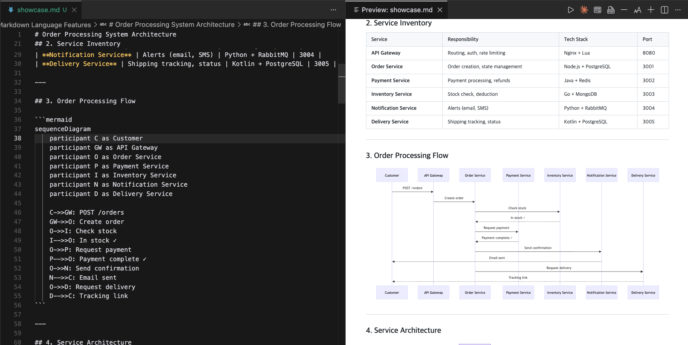
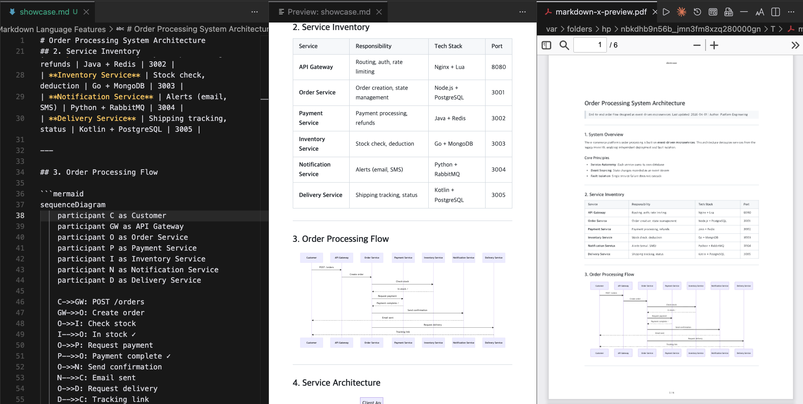
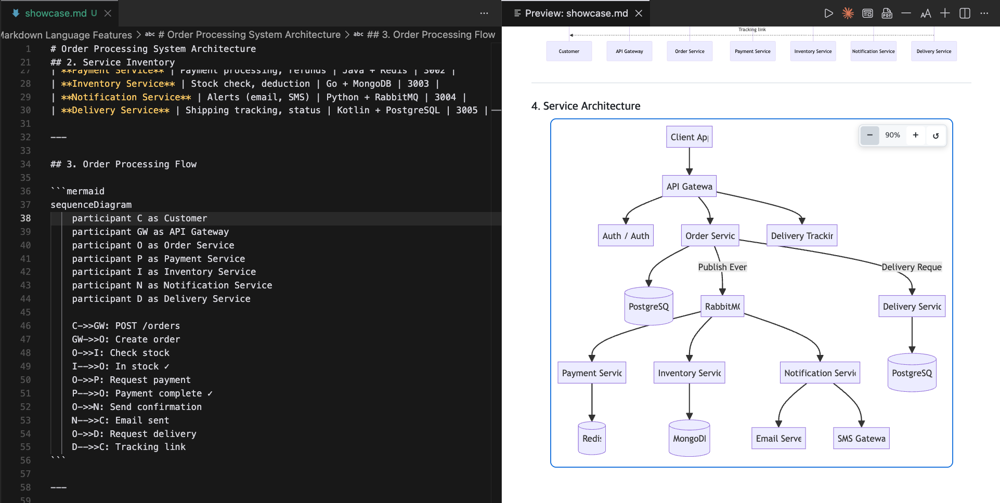

# Markdown X

[](https://marketplace.visualstudio.com/items?itemName=xieum-cloud.markdown-x)
[](https://marketplace.visualstudio.com/items?itemName=xieum-cloud.markdown-x)

Ultimate Markdown Viewer for VSCode with high-quality document export.

Markdown X is a **viewer-focused** extension. It does not add editing features -- it renders your markdown beautifully and exports it to PDF and Word with page-aware layout.



## Features

### Preview

- **Real-time preview** with side-by-side editing
- **Syntax highlighting** for 20+ languages (server-side via highlight.js)
- **Mermaid diagrams** -- flowchart, sequence, class, state, gantt, pie, ER
- **KaTeX math** -- inline `$E=mc^2$` and block `$$...$$`
- **Image lightbox** -- click to zoom, ESC to close
- **Scroll sync** -- editor to preview synchronization
- **4 themes** -- Auto (follows VS Code), Light, Dark, Sepia

### Page Preview



- **PDF-based page preview** -- generates a real PDF and opens it in a VSCode tab
- **100% accurate** -- shows exactly what the exported PDF will look like
- **Same-tab refresh** -- click again to regenerate with latest changes

### Export

- **PDF** -- via system Chrome/Edge (puppeteer-core, no bundled Chromium)
  - Page-aware layout: tables, images, code blocks avoid splitting
  - Long tables: auto-split with repeated headers
  - Long code blocks: auto-split with "(continued)" labels
  - Header/footer with title and page numbers
  - Configurable page size (A4, A3, Letter, Legal) and margins
  - Auto-opens in system PDF viewer after export
- **Word (.docx)** -- via html-to-docx
- **Print** -- opens in system browser with auto-print

### Customization

- **Font family** -- choose from preset Korean/English fonts or enter custom
- **Font size** -- adjustable via toolbar (+/-), direct input, or settings (10-32px)
- **Theme** -- Auto, Light, Dark, Sepia
- **Custom CSS** -- external CSS file or inline CSS
- **Code font** -- separate font setting for code blocks
- **Page size and margins** -- for PDF export

### Diagram Controls



- **Hover to resize** -- floating toolbar appears on mermaid diagrams
- **Scale 30%-200%** with +/- buttons
- **Reset** to original size
- **Auto-save to source** -- `<!-- mermaid-scale: N% -->` comment is inserted into markdown, ensuring PDF export matches the preview

### Outline Navigation

- **VSCode Outline panel** -- auto-generated from headings (H1-H6)
- **Hierarchical tree** -- nested by heading level
- **Click to jump** -- navigates editor and preview to heading position
- **Quick navigation** -- Cmd+Shift+O for symbol search

## Commands

| Command | Description |
| ------- | ----------- |
| `Markdown X: Open Preview` | Open preview to the side |
| `Markdown X: Refresh Preview` | Force refresh preview |
| `Markdown X: Page Preview` | Generate PDF and show in VSCode tab |
| `Markdown X: Export to PDF` | Export as PDF with page-aware layout |
| `Markdown X: Export to Word` | Export as .docx |
| `Markdown X: Print` | Open in browser for printing |
| `Markdown X: Set Font Size` | Enter font size directly |
| `Markdown X: Increase/Decrease Font Size` | Adjust font size by 2px |
| `Markdown X: Change Font` | Select font family |
| `Markdown X: Change Theme` | Select preview theme |
| `Markdown X: Change Page Size` | Select page size |
| `Markdown X: Change Page Margin` | Select page margins |

## Settings

| Setting | Default | Description |
| ------- | ------- | ----------- |
| `markdown-x.theme` | `auto` | Preview theme |
| `markdown-x.fontSize` | `16` | Font size (px) |
| `markdown-x.lineHeight` | `1.6` | Line height |
| `markdown-x.fontFamily` | system | Body font family |
| `markdown-x.codeFontFamily` | monospace | Code block font |
| `markdown-x.enableMermaid` | `true` | Enable Mermaid diagrams |
| `markdown-x.enableImageLightbox` | `true` | Enable image click-to-zoom |
| `markdown-x.enableScrollSync` | `true` | Enable scroll sync |
| `markdown-x.maxTocLevel` | `6` | Max heading level in TOC |
| `markdown-x.customCssPath` | | Path to custom CSS file |
| `markdown-x.customCss` | | Inline custom CSS |
| `markdown-x.pdf.pageSize` | `A4` | PDF page size |
| `markdown-x.pdf.margin` | `20mm` | PDF margins |
| `markdown-x.pdf.headerFooter` | `true` | Show header/footer in PDF |

## Page Break Handling

Markdown X automatically prevents content from splitting across pages during PDF export:

| Element | Size | Handling |
| ------- | ---- | -------- |
| Table, code, image | Fits on page | `break-inside: avoid` (CSS) |
| Heading | Any | `break-after: avoid` -- stays with next content |
| Paragraph | Any | `orphans: 3; widows: 3` -- min 3 lines at break |
| Long table | Exceeds page | Auto-split with repeated header rows |
| Long code block | Exceeds page | Auto-split with "(continued)" label |
| Manual break | User-defined | `<!-- pagebreak -->` in markdown |

## Diagram Scale

Resize diagrams in the preview and the scale is saved to the markdown source:

```markdown
<!-- mermaid-scale: 70% -->
```

This ensures the PDF export renders diagrams at exactly the same size as the preview.

## Requirements

- **VSCode** 1.74+
- **Chrome, Edge, or Chromium** -- required for PDF export and page preview (auto-detected)

## Internationalization

- English (default)
- Korean (ko)

## Development

```bash
# Install dependencies
npm install

# Compile
npm run compile

# Watch mode
npm run watch

# Run tests
npx ts-node src/markdownParser.test.ts

# Debug: press F5 in VSCode
```

## Project Structure

```text
src/
  extension.ts            Entry point, command registration
  previewProvider.ts       Webview preview panel
  markdownParser.ts        Markdown parser (marked + highlight.js)
  outlineProvider.ts       Document symbol provider for Outline panel
  export/
    exportPdf.ts           PDF export (puppeteer-core)
    previewPdf.ts          PDF page preview in VSCode tab
    exportDocx.ts          Word export (html-to-docx)
    printDocument.ts       Print via browser
    printStyles.ts         Export HTML template + print CSS
    chromeFinder.ts        System Chrome/Edge detection
    pageBreakProcessor.ts  Long table/code auto-split for PDF
```

## Feedback

- Bug reports and feature requests: [GitHub Issues](https://github.com/xieum-cloud/markdown-x/issues)

## License

MIT

## Author

ilovecorea (<xieum@icloud.com>)
