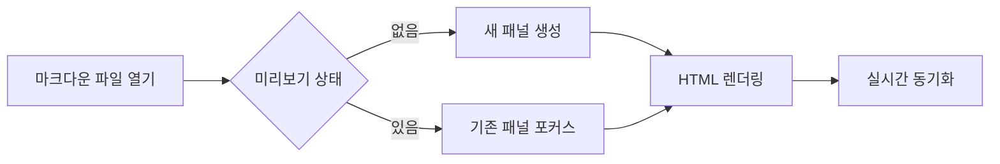
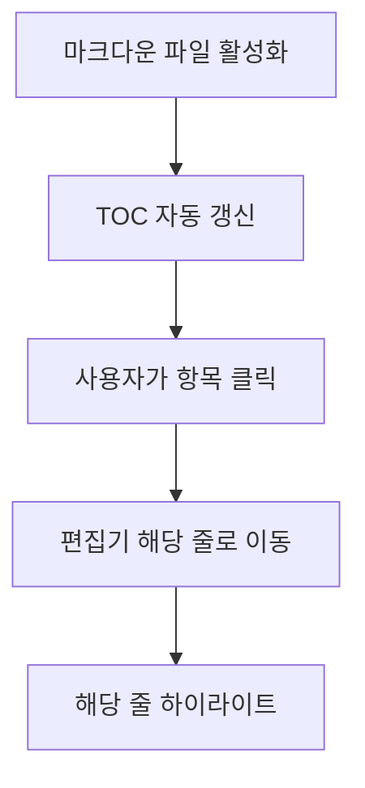
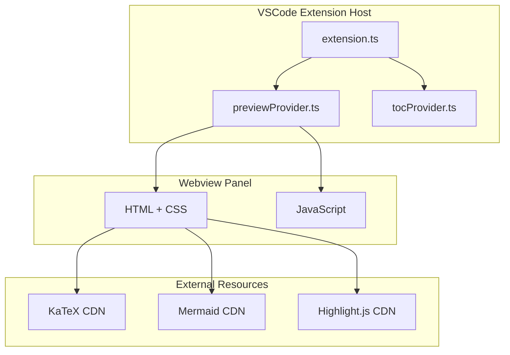

# Markdown X - UX/기술 설계서

> 작성일: 2026-03-30
> 버전: 0.1.0

## 1. 개요

### 1.1 제품 비전
Markdown X는 VSCode에서 최고의 마크다own 읽기 및 편집 경험을 제공하는 확장 프로그램입니다.

### 1.2 핵심 가치
- **즉각적인 피드백**: 실시간 미리보기로 작성 내용 즉시 확인
- **직관적인 탐색**: TOC를 통한 문서 구조 빠른 이동
- **눈의 편안함**: 다양한 테마 지원 (라이트/다크/세피아)
- **안전한 환경**: XSS 방지 및 보안 강화

## 2. 사용자 페르소나

### 2.1 개발자 Alex
- **나이**: 28세
- **직업**: 백엔드 개발자
- **니즈**: 기술 문서 작성, API 문서화
- **통증점**: 복잡한 마크다운 테이블 작성 시 미리보기 불편
- **사용 패턴**: VSCode 내에서 모든 작업 수행 선호

### 2.2 기술 작가 Sarah
- **나이**: 32세
- **직업**: 기술 문서 작가
- **니즈**: 긴 문서 작성 시 구조 파악, 이미지 포함 문서
- **통증점**: 긴 문서에서 특정 섹션 찾기 어려움
- **사용 패턴**: TOC 활용한 빠른 네비게이션 필요

### 2.3 학생 Minjun
- **나이**: 22세
- **직업**: 대학생
- **니즈**: 과제, 노트 정리
- **통증점**: 밤새 작업 시 눈의 피로
- **사용 패턴**: 세피아 테마 선호, 다이어그램 활용

## 3. 사용자 흐름 (User Flow)

### 3.1 기본 사용 흐름
```
마크다운 파일 열기
    ↓
미리보기 열기 (Command Palette / 버튼)
    ↓
실시간 편집 + 미리보기
    ↓
TOC로 섹션 이동
    ↓
이미지 클릭 → 라이트박스 확대
    ↓
테마 변경 (필요시)
```

### 3.2 기능별 상세 흐름

#### 미리보기 열기


#### TOC 네비게이션


## 4. UI/UX 설계

### 4.1 정보 구조 (Information Architecture)

```
Markdown X
├── Preview Panel (Webview)
│   ├── Markdown Content
│   ├── Code Blocks (highlight.js)
│   ├── Math (KaTeX)
│   ├── Diagrams (Mermaid)
│   └── Lightbox (Image Zoom)
│
├── TOC Sidebar (Tree View)
│   ├── Heading 1
│   │   └── Heading 2
│   ├── Heading 1
│   └── ...
│
└── Commands
    ├── Open Preview
    ├── Open Preview to Side
    ├── Refresh Preview
    ├── Change Theme
    └── Toggle TOC
```

### 4.2 인터랙션 디자인

#### 테마 변경
| 상태 | 동작 | 피드백 |
|------|------|--------|
| 클릭 | Quick Pick 메뉴 | 테마 목록 표시 |
| 선택 | 설정 저장 + 적용 | 미리보기 즉시 변경 |
| 변경 | Webview 리로드 | Mermaid 테마 동기화 |

#### 이미지 라이트박스
| 상태 | 동작 | 피드백 |
|------|------|--------|
| 호버 | cursor: zoom-in | 확대 가능 표시 |
| 클릭 | 라이트박스 열기 | 페이드 인 애니메이션 |
| 배경 클릭 | 라이트박스 닫기 | 페이드 아웃 애니메이션 |
| ESC 키 | 라이트박스 닫기 | 동일 |

### 4.3 디자인 시스템

#### 테마 색상
```css
/* Light */
--bg-color: #ffffff;
--text-color: #24292f;
--link-color: #0969da;

/* Dark */
--bg-color: #0d1117;
--text-color: #c9d1d9;
--link-color: #58a6ff;

/* Sepia */
--bg-color: #f4ecd8;
--text-color: #5b4636;
--link-color: #0066cc;
```

#### 타이포그래피
- **Font Family**: -apple-system, BlinkMacSystemFont, 'Segoe UI', Roboto
- **Font Size**: 16px (configurable)
- **Line Height**: 1.6 (configurable)

## 5. 기능 명세

### 5.1 미리보기 (Preview)
| 기능 | 우선순위 | 설명 |
|------|----------|------|
| 실시간 렌더링 | P0 | 편집 시 즉시 미리보기 갱신 |
| 코드 하이라이팅 | P0 | highlight.js 통합 |
| 수학식 렌더링 | P1 | KaTeX 지원 |
| Mermaid 다이어그램 | P1 | 다이어그램 렌더링 |
| 스크롤 동기화 | P2 | 편집기-미리보기 스크롤 연동 |

### 5.2 TOC (Table of Contents)
| 기능 | 우선순위 | 설명 |
|------|----------|------|
| 자동 생성 | P0 | 헤딩 기반 TOC 생성 |
| 계층 표시 | P0 | H1-H6 트리 구조 |
| 클릭 네비게이션 | P0 | 클릭 시 해당 위치 이동 |
| 최대 레벨 설정 | P2 | 표시할 최대 헤딩 레벨 설정 |

### 5.3 테마 (Theme)
| 기능 | 우선순위 | 설명 |
|------|----------|------|
| Auto | P0 | VSCode 테마 따라가기 |
| Light/Dark | P0 | 고정 테마 |
| Sepia | P1 | 눈에 편안한 테마 |
| 폰트 크기 조절 | P2 | 10-32px 설정 |

### 5.4 이미지 (Image)
| 기능 | 우선순위 | 설명 |
|------|----------|------|
| 기본 표시 | P0 | 마크다운 이미지 렌더링 |
| 라이트박스 | P1 | 클릭 시 확대 |
| 상대 경로 지원 | P1 | ./image.png 처리 |

## 6. 기술 아키텍처

### 6.1 시스템 구조


### 6.2 데이터 흐름
```mermaid
sequenceDiagram
    participant User
    participant Editor as VSCode Editor
    participant Ext as Extension
    provider PP as PreviewProvider
    participant Webview
    
    User->>Editor: 마크다운 편집
    Editor->>Ext: onDidChangeTextDocument
    Ext->>PP: updateContent()
    PP->>PP: parseMarkdown()
    PP->>Webview: HTML 전송
    Webview->>Webview: 렌더링
```

### 6.3 파일 구조
```
markdown-x/
├── src/
│   ├── extension.ts          # 진입점, 명령 등록
│   ├── previewProvider.ts    # 미리보기 웹뷰 관리
│   └── tocProvider.ts        # TOC 트리뷰 관리
├── out/                      # 컴파일 출력
├── package.json              # 확장 설정
├── package.nls.json          # 영어 번역
├── package.nls.ko.json       # 한국어 번역
└── tsconfig.json             # TypeScript 설정
```

## 7. 보안 설계

### 7.1 XSS 방지
| 위치 | 위협 | 대응 |
|------|------|------|
| HTML 이스케이프 | `<script>` 주입 | `&`, `<`, `>` → HTML entities |
| 링크 href | `javascript:` 프로토콜 | URL 스키마 화이트리스트 |
| 이미지 alt | `"` 클릭재킹 | HTML entities 이스케이프 |
| 이미지 src | 악성 URL | 프로토콜 검증 |

### 7.2 콘텐츠 보안 정책 (CSP)
- 외부 CDN 리소스만 허용 (KaTeX, Mermaid, Highlight.js)
- `unsafe-inline` 스크립트 제한
- `unsafe-eval` 금지

### 7.3 Mermaid 보안
```javascript
// BEFORE (취약)
securityLevel: 'loose'

// AFTER (권장)
securityLevel: 'strict'  // 또는 'antiscript'
```

## 8. 국제화 (i18n) 전략

### 8.1 지원 언어
| 언어 | 코드 | 상태 |
|------|------|------|
| English | en | ✅ 완료 |
| 한국어 | ko | ✅ 완료 |

### 8.2 구현 방식
VSCode NLS (Natural Language Support) 사용:
- `package.nls.json` - 기본 (영어)
- `package.nls.ko.json` - 한국어
- `%key%` 형태로 `package.json`에서 참조

### 8.3 확장 계획
- 일본어 (ja)
- 중국어 간체 (zh-cn)
- 독일어 (de)

## 9. 성능 고려사항

### 9.1 렌더링 최적화
- 디바운싱: 100ms 지연으로 연속 입력 처리
- Virtual Scrolling: 대용량 문서 지원 (P3)
- 이미지 Lazy Loading: 화면 밖 이미지 지연 로드 (P2)

### 9.2 메모리 관리
- Webview `retainContextWhenHidden: true`
- 패널 닫힐 때 리소스 정리

## 10. 향후 로드맵

### Phase 1 (현재)
- [x] 기본 미리보기
- [x] TOC 네비게이션
- [x] 테마 지원
- [x] 이미지 라이트박스
- [x] KaTeX, Mermaid 지원
- [x] 영어/한국어 i18n

### Phase 2 (예정)
- [ ] 커스텀 CSS / 글꼴 / 폰트 크기 설정
- [ ] PDF 내보내기 (페이지 인식 레이아웃 — 표/그림 잘림 방지)
- [ ] Word(.docx) 내보내기
- [ ] HWP 내보내기
- [ ] 인쇄 기능

### Phase 3 (장기)
- [ ] 추가 언어 지원 (ja, zh-cn 등)

## 11. 부록

### A. 변경 이력
| 날짜 | 버전 | 변경 내용 |
|------|------|-----------|
| 2026-03-30 | 0.1.0 | 초기 설계서 작성 |

### B. 참고 자료
- [VSCode Extension API](https://code.visualstudio.com/api)
- [VSCode Webview](https://code.visualstudio.com/api/extension-guides/webview)
- [VSCode NLS](https://code.visualstudio.com/api/references/localization)
- [Mermaid Security](https://mermaid.js.org/config/usage.html#security-level)
