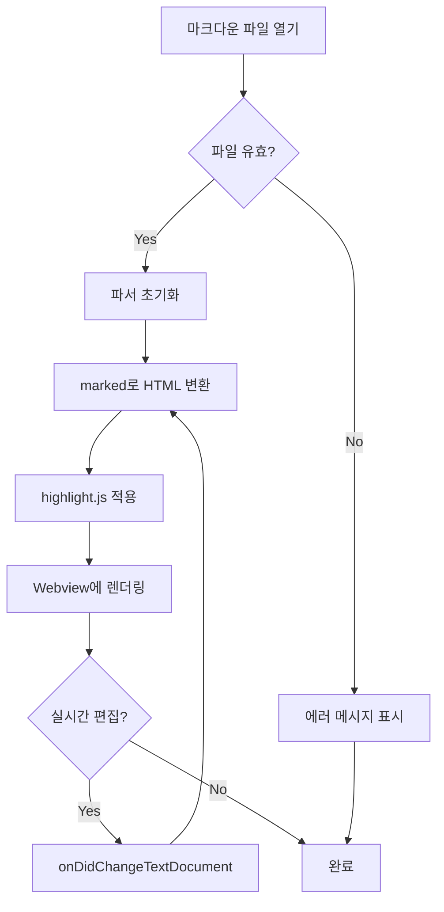
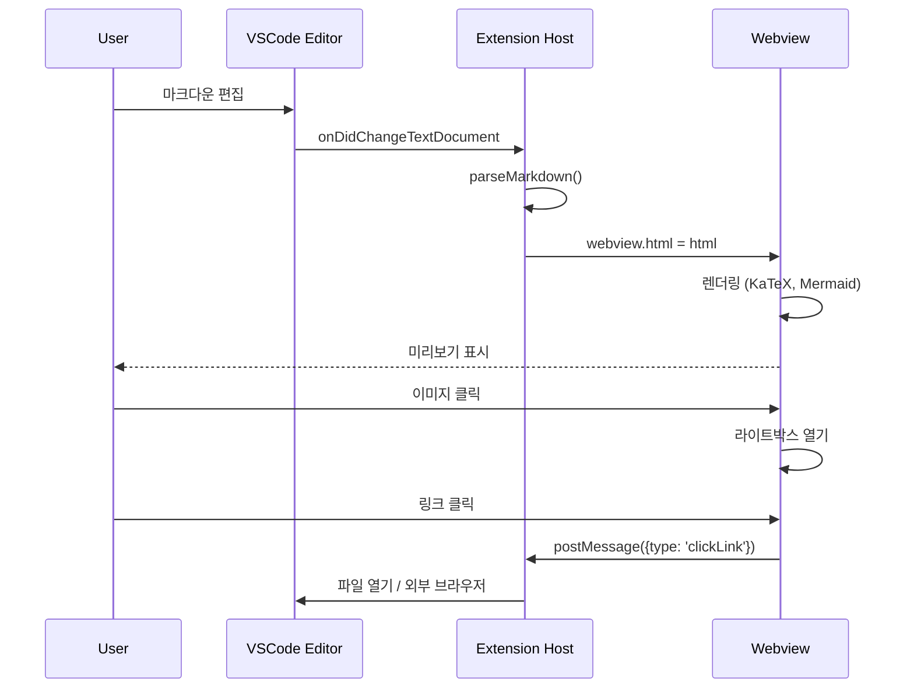
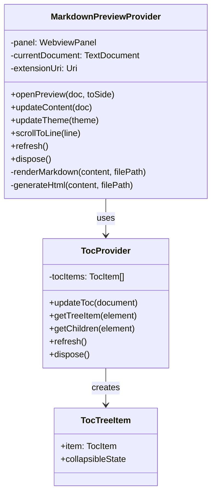
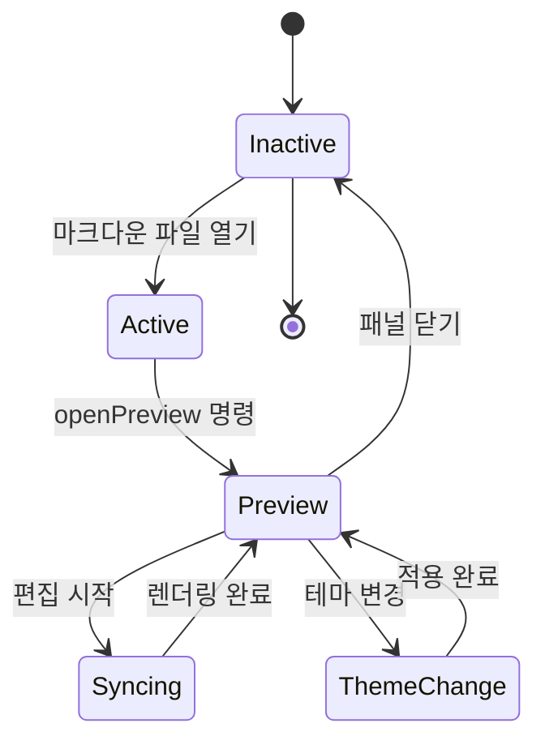
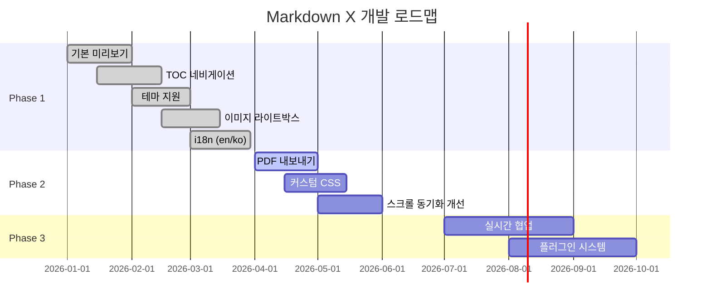
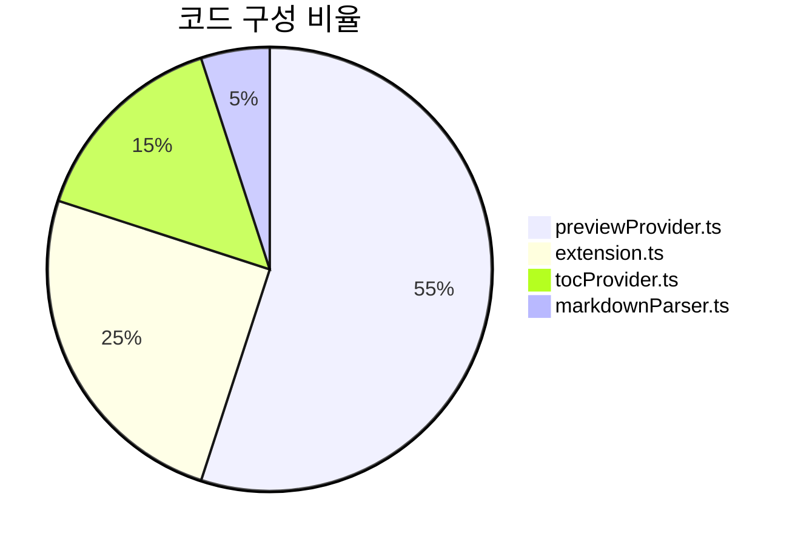
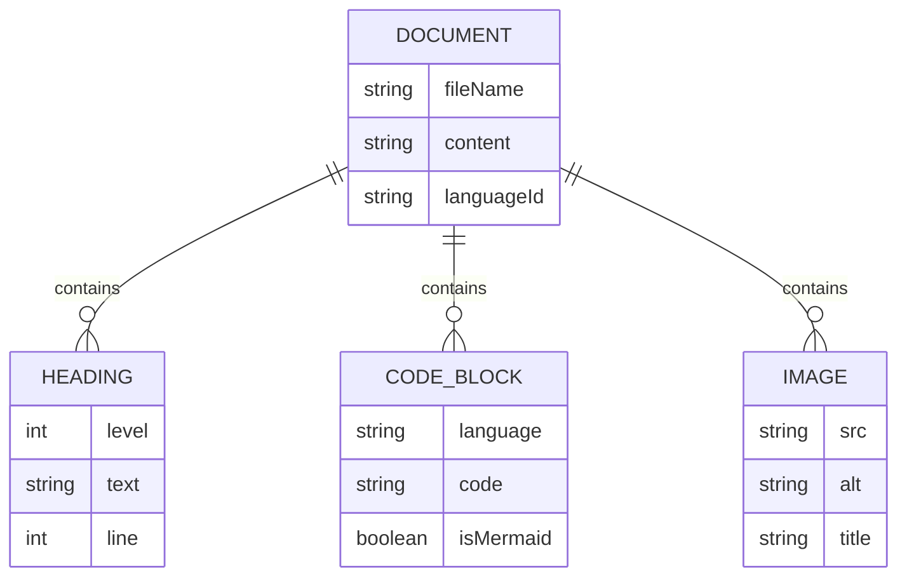
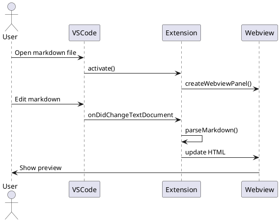
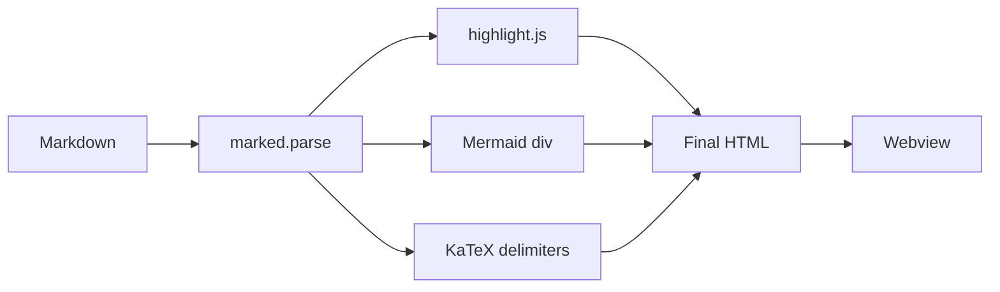

# Markdown X Demo Document

> 이 문서는 Markdown X 확장의 다양한 렌더링 기능을 테스트하기 위한 샘플입니다.

---

## 1. 텍스트 서식 (Text Formatting)

### 1.1 기본 서식

일반 텍스트입니다. **굵게(Bold)** 표시할 수 있고, *기울임(Italic)* 도 됩니다.
***굵은 기울임*** 도 가능하며, ~~취소선~~ 도 지원합니다.

인라인 코드는 `console.log("Hello")` 이렇게 표시됩니다.

### 1.2 링크와 참조

- 외부 링크: [GitHub](https://github.com)
- 메일 링크: [이메일 보내기](mailto:test@example.com)
- 앵커 링크: [Mermaid 섹션으로 이동](#3-다이어그램-diagrams)

---

## 2. 코드 블록 (Code Blocks)

### 2.1 JavaScript

```javascript
class MarkdownParser {
  constructor(options = {}) {
    this.theme = options.theme || 'auto';
    this.plugins = new Map();
  }

  async parse(content) {
    const tokens = this.tokenize(content);
    const ast = this.buildAST(tokens);
    return this.render(ast);
  }

  // Arrow function & template literal
  highlight = (code, lang) => {
    return `<pre class="language-${lang}">${code}</pre>`;
  };
}

const parser = new MarkdownParser({ theme: 'dark' });
console.log(await parser.parse('# Hello World'));
```

### 2.2 Python

```python
from dataclasses import dataclass
from typing import Optional
import asyncio

@dataclass
class Document:
    title: str
    content: str
    author: Optional[str] = None
    tags: list[str] = None

    def word_count(self) -> int:
        return len(self.content.split())

    async def save(self, path: str) -> None:
        async with aiofiles.open(path, 'w') as f:
            await f.write(self.to_json())

# Dictionary comprehension
stats = {doc.title: doc.word_count() for doc in documents if doc.tags}
```

### 2.3 TypeScript

```typescript
interface PreviewConfig {
  theme: 'auto' | 'light' | 'dark' | 'sepia';
  fontSize: number;
  lineHeight: number;
  enableMermaid: boolean;
}

type DeepPartial<T> = {
  [P in keyof T]?: T[P] extends object ? DeepPartial<T[P]> : T[P];
};

function mergeConfig(
  base: PreviewConfig,
  overrides: DeepPartial<PreviewConfig>
): PreviewConfig {
  return { ...base, ...overrides };
}
```

### 2.4 SQL

```sql
SELECT
    u.name,
    u.email,
    COUNT(o.id) AS order_count,
    SUM(o.total) AS total_spent
FROM users u
LEFT JOIN orders o ON u.id = o.user_id
WHERE u.created_at >= '2025-01-01'
GROUP BY u.id, u.name, u.email
HAVING COUNT(o.id) > 5
ORDER BY total_spent DESC
LIMIT 20;
```

### 2.5 Shell

```bash
#!/bin/bash
set -euo pipefail

echo "🚀 Building Markdown X..."
npm run compile && npm run test

if [ $? -eq 0 ]; then
    echo "✅ Build successful"
    vsce package --out ./dist/
else
    echo "❌ Build failed"
    exit 1
fi
```

### 2.6 JSON

```json
{
  "name": "markdown-x",
  "version": "0.1.0",
  "engines": { "vscode": "^1.74.0" },
  "categories": ["Programming Languages", "Visualization"],
  "contributes": {
    "commands": [
      { "command": "markdown-x.openPreview", "title": "Open Preview" }
    ]
  }
}
```

### 2.7 CSS

```css
:root {
  --primary: #0969da;
  --bg: #ffffff;
  --text: #24292f;
}

.container {
  max-width: 900px;
  margin: 0 auto;
  padding: 2rem;
}

@media (prefers-color-scheme: dark) {
  :root {
    --primary: #58a6ff;
    --bg: #0d1117;
    --text: #c9d1d9;
  }
}
```

---

## 3. 다이어그램 (Diagrams)

### 3.1 Mermaid - Flowchart

<!-- mermaid-scale: 90% -->


### 3.2 Mermaid - Sequence Diagram

<!-- mermaid-scale: 90% -->


### 3.3 Mermaid - Class Diagram

<!-- mermaid-scale: 70% -->


### 3.4 Mermaid - State Diagram



### 3.5 Mermaid - Gantt Chart



### 3.6 Mermaid - Pie Chart



### 3.7 Mermaid - ER Diagram



### 3.8 PlantUML (미지원 - 향후 추가 예정)

PlantUML은 현재 Markdown X에서 지원하지 않습니다. 아래는 향후 지원을 위한 예시입니다:



> **Note**: PlantUML 지원이 필요하시면 [PlantUML Extension](https://marketplace.visualstudio.com/items?itemName=jebbs.plantuml)을 함께 설치해 주세요.

---

## 4. 테이블 (Tables)

### 4.1 기본 테이블

| 기능 | 상태 | 우선순위 | 담당자 |
|------|------|----------|--------|
| 마크다운 프리뷰 | ✅ 완료 | P0 | Frontend |
| TOC 네비게이션 | ✅ 완료 | P0 | Frontend |
| 테마 지원 | ✅ 완료 | P1 | Design |
| 스크롤 동기화 | ✅ 완료 | P2 | Frontend |
| PDF 내보내기 | 🔄 진행중 | P2 | Backend |
| 실시간 협업 | 📋 계획 | P3 | Full Stack |

### 4.2 정렬된 테이블

| 왼쪽 정렬 | 가운데 정렬 | 오른쪽 정렬 |
|:-----------|:----------:|------------:|
| Left | Center | Right |
| 텍스트 | 텍스트 | 텍스트 |
| `code` | **bold** | *italic* |

### 4.3 복잡한 테이블

| HTTP Method | Endpoint | Description | Auth Required |
|-------------|----------|-------------|:-------------:|
| `GET` | `/api/docs` | 문서 목록 조회 | ❌ |
| `GET` | `/api/docs/:id` | 문서 상세 조회 | ❌ |
| `POST` | `/api/docs` | 새 문서 생성 | ✅ |
| `PUT` | `/api/docs/:id` | 문서 수정 | ✅ |
| `DELETE` | `/api/docs/:id` | 문서 삭제 | ✅ |

---

## 5. 리스트 (Lists)

### 5.1 비순서 리스트

- 첫 번째 항목
- 두 번째 항목
  - 중첩 항목 A
  - 중첩 항목 B
    - 더 깊은 중첩
    - 또 다른 항목
  - 중첩 항목 C
- 세 번째 항목

### 5.2 순서 리스트

1. 프로젝트 설정
2. 의존성 설치
   1. `npm install marked`
   2. `npm install highlight.js`
3. 코드 작성
   1. `extension.ts` - 진입점
   2. `previewProvider.ts` - 프리뷰 엔진
   3. `tocProvider.ts` - 목차 생성기
4. 테스트
5. 배포

### 5.3 체크박스 리스트 (Task List)

- [x] 프로젝트 초기화
- [x] marked 라이브러리 통합
- [x] highlight.js 서버사이드 렌더링
- [x] XSS 방지 (HTML 이스케이프)
- [x] acquireVsCodeApi() 수정
- [x] 스크롤 동기화 구현
- [x] 단위 테스트 작성
- [ ] PDF 내보내기
- [ ] 커스텀 CSS 지원
- [ ] PlantUML 지원

### 5.4 혼합 리스트

1. **Phase 1** - 기본 기능
   - [x] 마크다운 렌더링
   - [x] 코드 하이라이팅
   - [x] 테마 지원
2. **Phase 2** - 고급 기능
   - [ ] PDF 내보내기
   - [ ] 커스텀 CSS
3. **Phase 3** - 확장
   - [ ] 플러그인 시스템
   - [ ] 실시간 협업

---

## 6. 인용문 (Blockquotes)

> 단순한 인용문입니다.

> **Albert Einstein**
>
> 상상력은 지식보다 중요하다. 지식은 한계가 있지만, 상상력은 세상의 모든 것을 감싼다.

> #### 중첩된 인용문
>
> 첫 번째 레벨의 인용문입니다.
>
> > 두 번째 레벨의 인용문입니다.
> >
> > > 세 번째 레벨까지 중첩할 수 있습니다.

> **💡 Tip**: `marked` 라이브러리를 사용하면 복잡한 마크다운도 정확하게 렌더링됩니다.
>
> ```javascript
> const html = marked.parse(markdown);
> ```

---

## 7. 수학식 (KaTeX)

### 7.1 인라인 수학식

아인슈타인의 질량-에너지 등가식은 $E = mc^2$ 입니다.

이차방정식의 근의 공식: $x = \frac{-b \pm \sqrt{b^2 - 4ac}}{2a}$

### 7.2 블록 수학식

$$
\int_{-\infty}^{\infty} e^{-x^2} dx = \sqrt{\pi}
$$

$$
\sum_{n=1}^{\infty} \frac{1}{n^2} = \frac{\pi^2}{6}
$$

$$
\begin{pmatrix}
a & b \\
c & d
\end{pmatrix}
\begin{pmatrix}
x \\
y
\end{pmatrix}
=
\begin{pmatrix}
ax + by \\
cx + dy
\end{pmatrix}
$$

---

## 8. 이미지 (Images)

### 8.1 외부 이미지


### 8.2 이미지 + 링크

[](https://code.visualstudio.com)
[](https://www.typescriptlang.org)
[](https://nodejs.org)

---

## 9. 수평선 (Horizontal Rules)

세 가지 방식으로 수평선을 만들 수 있습니다:

하이픈:

---

별표:

***

밑줄:

___

---

## 10. 특수 케이스 (Edge Cases)

### 10.1 긴 코드 줄 (가로 스크롤 테스트)

```javascript
const veryLongVariableName = someObject.someProperty.someNestedProperty.someMethod(firstArgument, secondArgument, thirdArgument, fourthArgument, fifthArgument);
```

### 10.2 HTML 이스케이프 테스트

다음 태그들은 이스케이프되어야 합니다:

- `<script>alert("XSS")</script>` → 코드로 표시
- `` → 코드로 표시
- `<a href="javascript:void(0)">click</a>` → 코드로 표시

### 10.3 특수 문자

| 기호 | 이름 | 설명 |
|------|------|------|
| & | Ampersand | HTML entity: `&amp;` |
| < | Less than | HTML entity: `&lt;` |
| > | Greater than | HTML entity: `&gt;` |
| " | Quote | HTML entity: `&quot;` |
| © | Copyright | Unicode |
| → | Arrow | Unicode |
| ★ | Star | Unicode |

### 10.4 매우 깊은 헤딩

#### Level 4 헤딩
##### Level 5 헤딩
###### Level 6 헤딩

---

## 11. 종합 테스트

이 섹션은 여러 요소가 **혼합**된 실제 문서 스타일입니다.

`MarkdownPreviewProvider` 클래스의 핵심 메서드인 `renderMarkdown()`는 다음과 같은 흐름으로 동작합니다:

1. `marked` 라이브러리로 마크다운 파싱
2. 커스텀 `Renderer`를 통해:
   - **코드 블록**: `highlight.js`로 서버사이드 하이라이팅
   - **Mermaid 블록**: `<div class="mermaid">`로 래핑
   - **이미지**: `webview.asWebviewUri()`로 경로 변환
   - **Raw HTML**: XSS 방지를 위해 이스케이프
3. 생성된 HTML을 Webview에 주입

> **성능 팁**: `retainContextWhenHidden: true` 옵션을 사용하면 탭 전환 시 Webview 상태가 유지됩니다.



---

*이 문서는 Markdown X의 모든 렌더링 기능을 검증하기 위한 테스트 문서입니다.*
