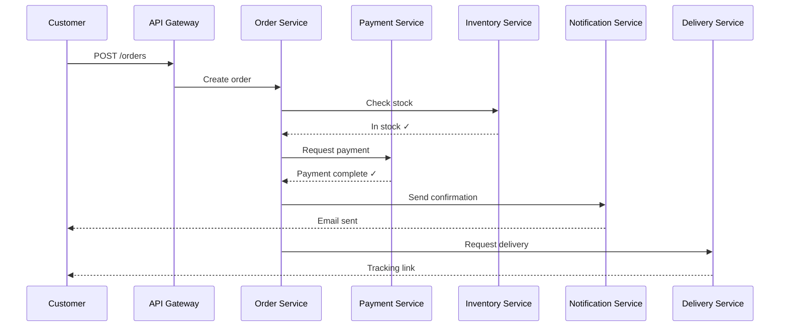
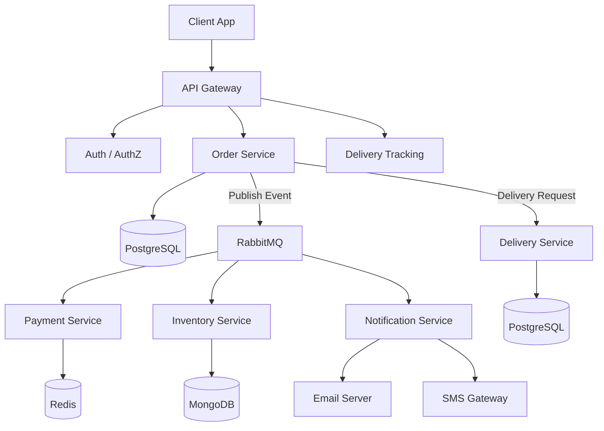
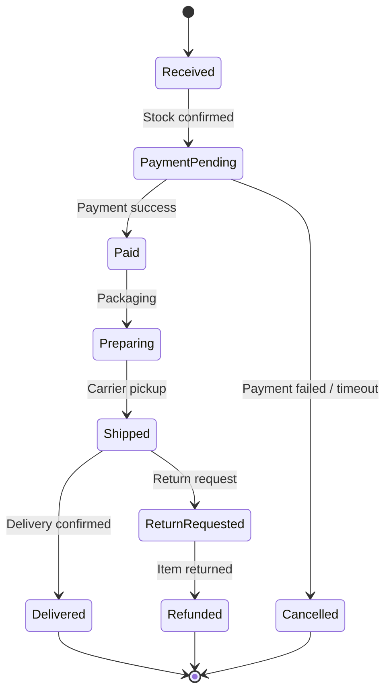

# Order Processing System Architecture

> End-to-end order flow designed as event-driven microservices.
> Last updated: 2026-04-01 | Author: Platform Engineering

---

## 1. System Overview

The e-commerce platform's order processing is built on **event-driven microservices**.
This architecture decouples services from the legacy monolith, enabling independent deployment and fault isolation.

### Core Principles

- **Service Autonomy**: Each service owns its own database
- **Event Sourcing**: State changes recorded as an event stream
- **Fault Isolation**: Single service failure does not cascade

---

## 2. Service Inventory

| Service | Responsibility | Tech Stack | Port |
| ------- | -------------- | ---------- | :--: |
| **API Gateway** | Routing, auth, rate limiting | Nginx + Lua | 8080 |
| **Order Service** | Order creation, state management | Node.js + PostgreSQL | 3001 |
| **Payment Service** | Payment processing, refunds | Java + Redis | 3002 |
| **Inventory Service** | Stock check, deduction | Go + MongoDB | 3003 |
| **Notification Service** | Alerts (email, SMS) | Python + RabbitMQ | 3004 |
| **Delivery Service** | Shipping tracking, status | Kotlin + PostgreSQL | 3005 |

---

## 3. Order Processing Flow



---

## 4. Service Architecture

<!-- mermaid-scale: 90% -->


---

## 5. Order State Machine



---

## 6. API Specification

### Create Order

```http
POST /api/v1/orders
Content-Type: application/json
Authorization: Bearer {token}
```

```json
{
  "items": [
    { "productId": "PROD-001", "quantity": 2, "price": 29.00 },
    { "productId": "PROD-042", "quantity": 1, "price": 15.00 }
  ],
  "shippingAddress": {
    "name": "John Doe",
    "phone": "+1-555-0123",
    "address": "123 Main St, San Francisco, CA 94102"
  },
  "paymentMethod": "CARD"
}
```

### Response

```json
{
  "orderId": "ORD-2026-0401-00123",
  "status": "PAYMENT_PENDING",
  "totalAmount": 73.00,
  "estimatedDelivery": "2026-04-03"
}
```

---

## 7. Core Implementation

### Order Creation Handler

```typescript
export class OrderService {
  constructor(
    private readonly orderRepo: OrderRepository,
    private readonly inventoryClient: InventoryClient,
    private readonly eventBus: EventBus,
  ) {}

  async createOrder(request: CreateOrderRequest): Promise<Order> {
    // 1. Verify stock availability
    const available = await this.inventoryClient.checkStock(request.items);
    if (!available) {
      throw new InsufficientStockError(request.items);
    }

    // 2. Persist order
    const order = Order.create({
      items: request.items,
      shippingAddress: request.shippingAddress,
      status: OrderStatus.PAYMENT_PENDING,
    });
    await this.orderRepo.save(order);

    // 3. Publish payment event
    await this.eventBus.publish(new OrderCreatedEvent(order));

    return order;
  }
}
```

---

## 8. CI/CD Pipeline

```mermaid
gantt
    title Deployment Pipeline
    dateFormat HH:mm
    axisFormat %H:%M

    section Build
        Checkout           :b1, 00:00, 1m
        Install deps       :b2, after b1, 2m
        Unit tests         :b3, after b2, 3m
        Docker build       :b4, after b3, 2m

    section Deploy
        Staging deploy     :d1, after b4, 2m
        Integration tests  :d2, after d1, 5m
        Production deploy  :d3, after d2, 3m
```



---

## 9. Monitoring Metrics

| Metric | Threshold | Alert Channel |
| ------ | :-------: | ------------- |
| Response time (p99) | < 500ms | Slack #ops |
| Error rate | < 0.1% | PagerDuty |
| Order throughput | > 100 TPS | Grafana |
| DB connection pool | < 80% | Slack #ops |
| Message queue lag | < 30s | PagerDuty |

> **SLA Target**: 99.95% availability, max 22 minutes downtime per month

---

## 10. Tech Debt & Roadmap

- [x] API Gateway rollout
- [x] Event-driven async processing
- [x] Per-service independent databases
- [ ] Distributed tracing (OpenTelemetry)
- [ ] Circuit breaker pattern
- [ ] GraphQL Federation

$$\text{System Availability} = \prod_{i=1}^{n} A_i = 0.999 \times 0.999 \times 0.999 = 99.7\%$$

> With each service at 99.9% availability, the overall availability of 3 services in series is **99.7%**.
> Circuit breakers and fallback strategies are needed to improve this.
